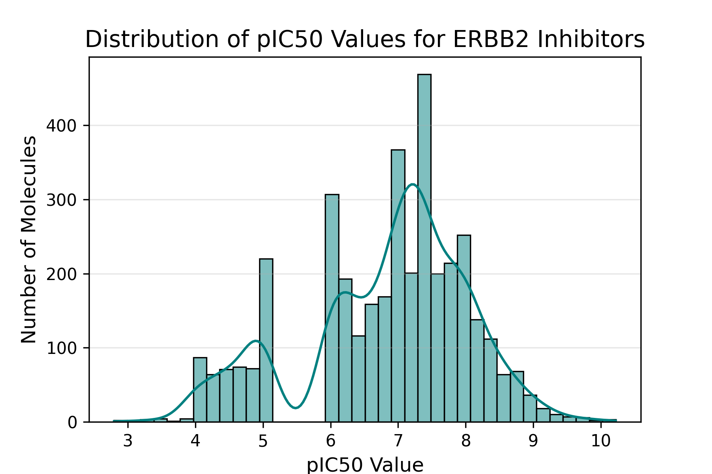
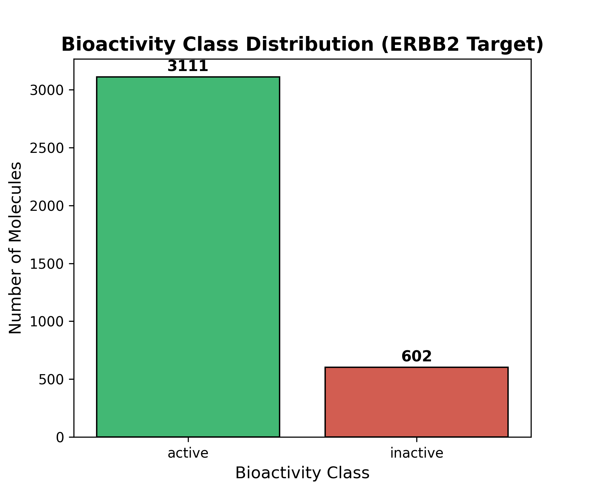

# AI and Drug Discovery: QSAR Data Curation & Descriptor Generation
**Target:** Receptor Tyrosine-protein kinase erbB-2 (ERBB2 / HER2)  
**ChEMBL ID:** [CHEMBL1824](https://www.ebi.ac.uk/chembl/target_report_card/CHEMBL1824/) | **PDB ID:** [2JWA](https://www.rcsb.org/structure/2JWA)

## 📋 Project Overview
This repository documents the end-to-end pipeline for data curation, exploratory analysis, and feature engineering for compounds targeting **ERBB2**. This target is a critical member of the epidermal growth factor receptor (EGFR) family and a major target in hepatocellular carcinoma and breast cancer research.

---

## 🚀 Task Summary

### Task 1 & 2: Data Retrieval & Curation
* **Source:** ChEMBL database.
* **Raw Data:** Retrieved 5,207 raw records.
* **Curation:** Processed to **3,713 high-quality records** after removing duplicates, handling missing values, and filtering for specific bioactivity units.
* **Bioactivity:** IC50 values were converted to **pIC50** ($-log_{10}(IC_{50})$) to normalize the distribution for machine learning.

### Task 3: EDA & Molecular Descriptors

* **Exploratory Data Analysis (EDA):** * Performed pIC50 distribution analysis and class balancing (Active vs. Inactive).
    * Conducted **Mann-Whitney U testing** to verify descriptor significance.
* **Chemical Descriptors:** * Calculated 1D/2D descriptors (MW, LogP, HBD, HBA) using **RDKit**.
    * **Results:** All four descriptors (MW, LogP, HBD, HBA) were found to be **statistically significant** ($p < 0.05$).
* **Molecular Fingerprints:** * Generated **2048-bit Morgan Fingerprints (Radius 2)**.
    * These fingerprints serve as the numerical input for future QSAR predictive modeling.

---

## 📊 Visualizations
| pIC50 Distribution | Bioactivity Class Count |
| :---: | :---: |
|  |  |

---

## 📂 Repository Contents
* `Assignment_3_EDA_Descriptors.ipynb`: Full Python implementation.
* `ERBB2_Morgan_Fingerprints.zip`: 2048-bit fingerprint feature matrix (Compressed).
* `pIC50_histogram.png`: Distribution plot of molecular potency.
* `bioactivity_class_plot.png`: Bar chart of Active vs. Inactive molecules.

---

## 🛠️ Tools & Libraries
- **RDKit:** Molecular informatics and fingerprinting.
- **Pandas/NumPy:** Data curation and matrix handling.
- **Seaborn/Matplotlib:** Statistical data visualization.
- **SciPy:** Statistical significance testing (Mann-Whitney U).
